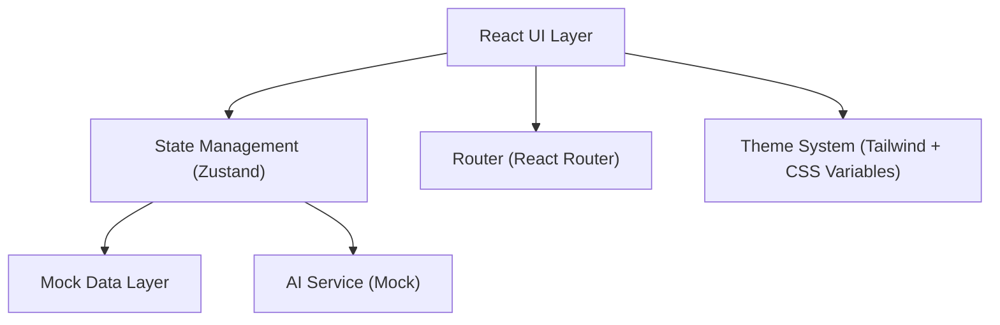

# CleanC — 技术架构文档 (Web版)

## 1. 架构设计



## 2. 技术说明

- **前端框架**：React 18 + TypeScript + Vite
- **样式方案**：Tailwind CSS 3 + CSS Variables（主题切换）
- **状态管理**：Zustand
- **路由**：React Router DOM v6
- **图表**：Recharts（环形图、折线图、面积图、雷达图）
- **图标**：lucide-react
- **Markdown渲染**：react-markdown
- **动画**：framer-motion
- **后端**：无（纯前端，Mock数据模拟）
- **数据库**：无（使用内存状态 + localStorage持久化设置）

## 3. 路由定义

| 路由 | 用途 |
|------|------|
| `/` | 仪表盘（首页） |
| `/quick-clean` | 快速清理 |
| `/detective` | 占用侦探 |
| `/deep-scan` | 深度扫描 |
| `/software-migrate` | 软件迁移 |
| `/path-migrate` | 路径迁移 |
| `/ai-assistant` | AI助手 |
| `/monitor` | 空间监控 |
| `/settings` | 设置 |
| `/about` | 关于 |

## 4. 项目结构

```
src/
├── main.tsx
├── App.tsx
├── index.css                    # 全局样式 + CSS变量
├── stores/
│   ├── useAppStore.ts           # 全局应用状态
│   ├── useDiskStore.ts          # 磁盘数据状态
│   └── useAIStore.ts            # AI对话状态
├── theme/
│   └── theme.ts                 # 主题配置（颜色/字体/间距）
├── components/
│   ├── layout/
│   │   ├── AppLayout.tsx        # 主布局（侧边栏+内容区）
│   │   ├── Sidebar.tsx          # 侧边栏导航
│   │   └── BottomBar.tsx        # 底部状态栏
│   ├── shared/
│   │   ├── RiskBadge.tsx        # 风险等级标签
│   │   ├── CompatibilityBadge.tsx # 兼容性标签
│   │   ├── HealthScore.tsx      # 健康评分仪表盘
│   │   ├── CircularProgress.tsx # 环形进度图
│   │   ├── LeaderboardMedal.tsx # 排行榜奖牌
│   │   └── AIFloatingButton.tsx # AI悬浮按钮
│   └── ai/
│       ├── ChatBubble.tsx       # 对话气泡
│       └── QuickCommandPanel.tsx # 快捷指令面板
├── pages/
│   ├── Dashboard.tsx            # 仪表盘
│   ├── QuickClean.tsx           # 快速清理
│   ├── Detective.tsx            # 占用侦探
│   ├── DeepScan.tsx             # 深度扫描
│   ├── SoftwareMigrate.tsx      # 软件迁移
│   ├── PathMigrate.tsx          # 路径迁移
│   ├── AIAssistant.tsx          # AI助手
│   ├── Monitor.tsx              # 空间监控
│   ├── Settings.tsx             # 设置
│   └── About.tsx                # 关于
├── data/
│   └── mockData.ts              # Mock数据
└── utils/
    ├── formatSize.ts            # 文件大小格式化
    └── riskLevel.ts             # 风险等级定义
```

## 5. 主题系统

使用 CSS Variables 实现浅色/暗色模式切换：

```css
:root {
  --color-primary: #FF6B35;
  --color-primary-light: #FF8F5E;
  --color-ai-start: #7C3AED;
  --color-ai-end: #3B82F6;
  --color-bg: #FAFAFA;
  --color-card: #FFFFFF;
  --color-sidebar: #FFFFFF;
  --color-text: #212121;
  --color-text-secondary: #757575;
}

[data-theme="dark"] {
  --color-primary: #FF8A5C;
  --color-primary-light: #FFB088;
  --color-ai-start: #A78BFA;
  --color-ai-end: #60A5FA;
  --color-bg: #1E1E1E;
  --color-card: #2D2D2D;
  --color-sidebar: #252526;
  --color-text: #E0E0E0;
  --color-text-secondary: #9E9E9E;
}
```

## 6. 数据模型

### 磁盘信息
```typescript
interface DiskInfo {
  drive: string;
  total: number;       // bytes
  used: number;
  available: number;
  type: 'SSD' | 'HDD';
  healthScore: number;  // 0-100
}
```

### 清理项
```typescript
interface CleanItem {
  id: string;
  name: string;
  path: string;
  size: number;
  riskLevel: 'safe' | 'warning' | 'danger';
  selected: boolean;
  description: string;
}
```

### 软件信息
```typescript
interface SoftwareInfo {
  id: string;
  name: string;
  icon: string;
  installPath: string;
  size: number;
  compatibility: 'compatible' | 'incompatible';
  category: string;
}
```

### AI对话
```typescript
interface ChatMessage {
  id: string;
  role: 'user' | 'assistant';
  content: string;
  timestamp: number;
  actions?: AIAction[];
}

interface AIAction {
  label: string;
  command: string;
}
```

### 占用记录
```typescript
interface OccupancyRecord {
  id: string;
  name: string;
  size: number;
  percentage: number;
  trend: 'up' | 'down' | 'stable';
  category: 'software' | 'folder' | 'fileType';
  children?: OccupancyRecord[];
}
```
