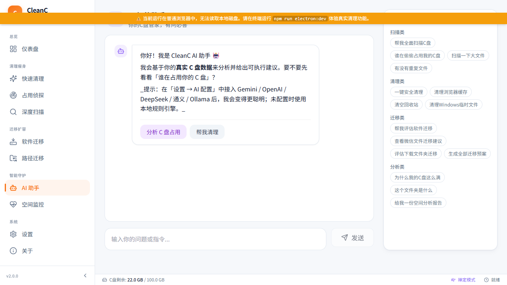
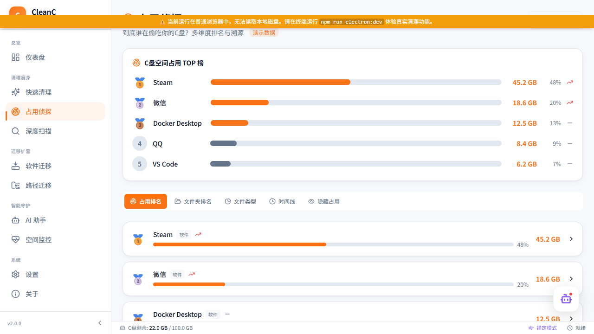
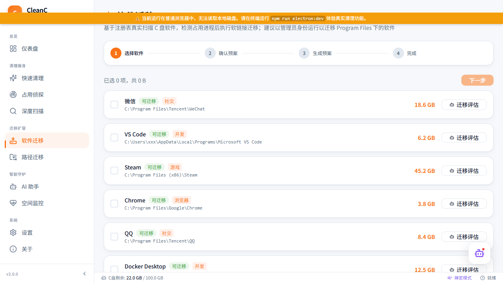

<div align="center">

# CleanC

**C 盘清理助手 — 让 C 盘焕然一新**

[](https://github.com/sherlockhomers/C_clean/releases)
[](LICENSE)
[](https://github.com/sherlockhomers/C_clean)
[](https://www.electronjs.org/)
[](https://react.dev/)

免费 · 无广告 · 无捆绑 · 本地运行 · 不收集隐私

[界面预览](#-界面预览) · [下载安装包](#-下载安装) · [功能介绍](#-功能特性) · [快速开始](#-快速开始) · [从源码构建](#-从源码构建) · [常见问题](#-常见问题)

</div>

---

## 📖 简介

**CleanC** 是一款面向普通 Windows 用户的 **C 盘深度清理与空间管理** 桌面工具。它把磁盘分析、垃圾清理、大文件扫描、软件/路径迁移、空间监控和 AI 助手整合在一个界面里，帮助你在 **安全可控** 的前提下释放 C 盘空间。

> **设计原则**：安全第一、迁移优于删除、操作可撤销、全程透明。

### v2.0.0 更新亮点

- **系统托盘常驻**：关闭窗口最小化到托盘，支持托盘快速清理与双击唤起
- **设置中心完善**：回收站开关、开机自启、关闭到托盘、低空间告警阈值、操作二次确认
- **AI 大模型接入**：可选 Gemini / OpenAI / DeepSeek / 通义千问 / Ollama，规则引擎兜底
- **深度扫描增强**：大文件流式扫描、重复文件检测、卸载残留扫描、批量删除/移入回收站
- **隐藏占用分析**：检测休眠文件、还原点、Windows 更新缓存等系统级占用
- **计划任务**：每周自动安全清理、每月扫描提醒、C 盘低空间系统通知
- **UI 全面升级**：分组导航、深色模式标题栏同步、视觉层次与动效打磨

---

## 🖼 界面预览

### 仪表盘 — 一眼掌握 C 盘健康状况

<p align="center">
  
</p>

<p align="center"><sub>实时展示 C 盘使用率、可清理/可迁移空间、健康评分与 AI 智能建议</sub></p>

### 占用侦探 — 揪出 C 盘「空间大户」

<p align="center">
  
</p>

<p align="center"><sub>多维度 TOP 榜：软件、文件夹、文件类型、时间线、隐藏占用一目了然</sub></p>

### 软件迁移 — 把大型应用搬出 C 盘

<p align="center">
  
</p>

<p align="center"><sub>自动识别可迁移软件，显示真实安装路径与占用大小，支持进程检测与关闭</sub></p>

### AI 助手 — 零门槛智能管家

<p align="center">
  
</p>

<p align="center"><sub>基于真实 C 盘数据对话分析，内置扫描/清理/迁移/分析四大类快捷指令</sub></p>

---

## ✨ 功能特性

### 核心能力

| 模块 | 说明 |
|------|------|
| **仪表盘** | 实时展示 C 盘使用率、可释放空间、健康评分；一键全面优化串联扫描→清理→报告 |
| **快速清理** | 扫描临时文件、浏览器缓存等，按风险等级分类；默认移入回收站（可恢复），可切换彻底删除 |
| **占用侦探** | 分析目录/文件类型占用，定位「谁占了 C 盘」；支持隐藏占用检测 |
| **深度扫描** | 大文件流式扫描、疑似重复文件检测、卸载残留扫描，实时进度反馈，批量删除 |
| **软件迁移** | 检测软件安装目录占用，识别运行中进程，支持关闭进程后迁移到其他盘 |
| **路径迁移** | 将用户目录（文档/下载等）迁移到其他盘，支持事务回滚与撤销 |
| **空间监控** | 记录磁盘空间快照，展示占用变化趋势；支持每周自动清理、低空间系统通知 |
| **AI 助手** | 内置基于真实磁盘数据的规则引擎，可选接入 Gemini / OpenAI / DeepSeek / 通义千问 / Ollama |
| **设置** | 操作历史记录与导出、迁移撤销、回收站开关、开机自启、关闭到托盘、AI 配置、缓存清理 |
| **系统托盘** | 托盘常驻、快速清理、双击唤起主窗口；关闭窗口可最小化到托盘继续守护 |

### 技术亮点

- **真实磁盘操作**：基于 Node.js `fs` / `fs.statfs`，非 Mock 数据
- **回收站优先**：清理默认走系统回收站（`shell.trashItem`），可恢复；高级用户可切换彻底删除
- **流式扫描**：大文件扫描通过 IPC 实时推送进度，避免界面卡顿
- **安全迁移**：同盘 `rename`、跨盘备份 + 软链接，支持 `undoMigration` 撤销；迁移前强制确认
- **路径保护**：`isProtectedPath` 拦截系统关键目录，防止误删
- **智能防误判**：卸载残留扫描多语言关键词交叉比对，降低误删风险
- **性能优化**：目录扫描排除 Junction/符号链接，防止死循环；清理任务并发限制
- **后台守护**：每周自动清理、每月扫描提醒、C 盘低空间系统通知（托盘常驻期间持续生效）
- **主题同步**：应用内浅色/深色主题与 Electron 原生标题栏 overlay 配色联动

---

## 📥 下载安装

前往 [**Releases 发布页**](https://github.com/sherlockhomers/C_clean/releases/latest) 下载最新版本：

| 文件 | 说明 | 推荐 |
|------|------|------|
| `CleanC_Setup_2.0.0.exe` | NSIS 安装包，支持自定义安装路径、创建桌面/开始菜单快捷方式 | ✅ 大多数用户 |
| `CleanC_Portable_2.0.0.exe` | 绿色便携版，解压即用，不写注册表 | 免安装场景 |

### 系统要求

- **操作系统**：Windows 10 / 11（64 位）
- **磁盘空间**：约 200 MB 安装空间
- **权限**：安装版启动时会请求管理员权限（用于清理系统目录、迁移 Program Files 软件与检测隐藏占用）

### 安装步骤（安装包）

1. 下载 `CleanC_Setup_2.0.0.exe`
2. 双击运行，按向导选择安装目录（建议非 C 盘）
3. 完成后从桌面或开始菜单启动 **CleanC**

> Windows 可能提示「未知发布者」，这是因为安装包尚未代码签名。源码完全开放，可自行审计或从源码构建。

---

## 🚀 快速开始

```
1. 打开 CleanC → 查看仪表盘，了解 C 盘当前状态
2. 进入「快速清理」→ 扫描 → 勾选安全项 → 一键清理
3. 若空间仍不足 →「深度扫描」查找大文件 / 重复文件 / 卸载残留
4. 需要腾挪空间 →「软件迁移」或「路径迁移」将内容搬到 D/E 盘
5. 在「设置」中查看操作历史，必要时撤销迁移
6. 可选：在「AI 助手」配置大模型 API Key，获取更智能的分析建议
```

---

## 🛠 从源码构建

### 环境要求

- [Node.js](https://nodejs.org/) 18+
- npm 9+
- Windows 10/11（构建目标平台）

### 开发模式

```bash
# 克隆仓库
git clone https://github.com/sherlockhomers/C_clean.git
cd C_clean

# 安装依赖
npm install

# 启动 Vite 开发服务器（仅前端）
npm run dev

# 或构建后启动 Electron（推荐，可访问真实磁盘）
npm run electron:dev
```

### 打包发布

```bash
npm run electron:build
```

构建产物默认输出到上级目录 `../CleanC-release/`，包含：

- `CleanC_Setup_x.x.x.exe` — 安装包
- `CleanC_Portable_x.x.x.exe` — 便携版
- `win-unpacked/` — 未打包目录

### 常用脚本

| 命令 | 说明 |
|------|------|
| `npm run dev` | Vite 前端热更新开发 |
| `npm run build` | 仅构建前端 |
| `npm run check` | TypeScript 类型检查 |
| `npm run electron:build` | 构建 Windows 安装包 |
| `npm run generate-icons` | 重新生成应用图标 |

---

## 📁 项目结构

```
C_clean/
├── electron/           # Electron 主进程（磁盘扫描、清理、迁移核心逻辑）
│   ├── main.js
│   └── preload.js
├── src/
│   ├── pages/          # 页面：仪表盘、快速清理、深度扫描等
│   ├── components/     # UI 组件（layout / shared / ui / ai）
│   ├── stores/         # Zustand 状态管理
│   └── utils/          # 工具函数
├── public/             # 静态资源与图标（icon.png / icon.ico）
├── docs/screenshots/   # README 界面预览截图
├── scripts/            # 截图采集等辅助脚本
├── package.json
└── README.md
```

---

## 🔒 安全与隐私

- **本地运行**：所有扫描与清理在本地完成，不上传文件内容
- **风险分级**：清理项标注安全 / 警告 / 危险，由用户自主选择
- **可撤销**：路径迁移支持撤销，操作历史可回溯与导出
- **路径保护**：系统关键目录自动拦截，防止误删
- **无广告无捆绑**：不包含第三方推广或静默安装
- **AI 可选**：大模型 API Key 仅存本地，不上传至 CleanC 服务器

---

## ❓ 常见问题

<details>
<summary><b>清理后空间没有明显变化？</b></summary>

部分文件可能被系统或其他程序占用。请关闭相关软件后重试，或使用「深度扫描」定位大文件与可迁移目录。

</details>

<details>
<summary><b>迁移失败怎么办？</b></summary>

前往「设置 → 操作历史」，找到对应迁移记录并执行撤销。跨盘迁移采用备份机制，降低数据丢失风险。

</details>

<details>
<summary><b>杀毒软件报毒？</b></summary>

未签名的 Electron 应用可能被误报。可从源码自行构建，或使用开源代码审计后添加白名单。

</details>

<details>
<summary><b>关闭窗口后程序还在运行？</b></summary>

默认开启「关闭到托盘」：窗口关闭后程序在系统托盘继续运行，执行计划任务与低空间监控。可在「设置」中关闭此行为。

</details>

<details>
<summary><b>支持 macOS / Linux 吗？</b></summary>

当前版本仅支持 Windows。跨平台支持在规划中。

</details>

---

## 🤝 参与贡献

欢迎提交 Issue 和 Pull Request！

1. Fork 本仓库
2. 创建特性分支：`git checkout -b feature/awesome-feature`
3. 提交更改：`git commit -m 'Add awesome feature'`
4. 推送分支：`git push origin feature/awesome-feature`
5. 发起 Pull Request

---

## 📄 许可证

本项目采用 [MIT License](LICENSE) 开源。

---

## 🙏 致谢

- [Electron](https://www.electronjs.org/) — 跨平台桌面框架
- [React](https://react.dev/) — UI 框架
- [Tailwind CSS](https://tailwindcss.com/) — 样式方案
- [Framer Motion](https://www.framer.com/motion/) — 动画库
- [Lucide](https://lucide.dev/) — 图标库
- [Zustand](https://zustand-demo.pmnd.rs/) — 轻量状态管理

---

<div align="center">

**如果 CleanC 帮到了你，欢迎点个 ⭐ Star！**

Made with ❤️ by [CleanC Team](https://github.com/sherlockhomers/C_clean)

</div>
